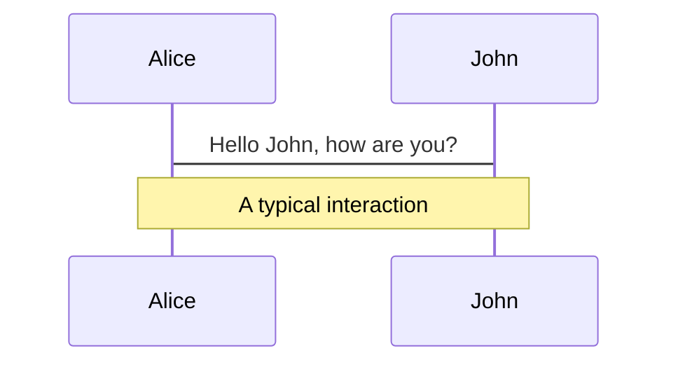
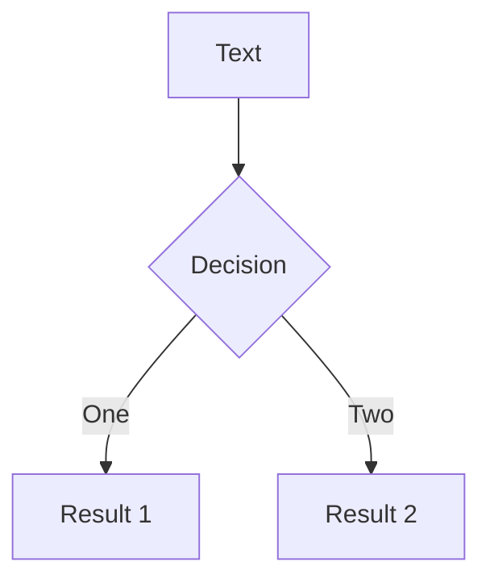
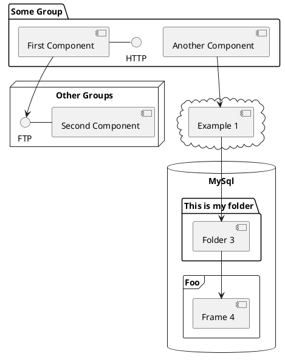

<div class="absolute bottom-10">
  <h1>HTML</h1>
  <p>(How To Make Lasagna)</p>
</div>


<!--
The last comment block of each slide will be treated as slide notes. It will be visible and editable in Presenter Mode along with the slide. [Read more in the docs](https://sli.dev/guide/syntax.html#notes)
-->

---
layout: default
---

# `<a>` : [The Anchor element](https://developer.mozilla.org/en-US/docs/Web/HTML/Element/a)

<div grid="~ cols-2 gap-4">
<div>

The anchor element, with its href attribute, creates a hyperlink to web pages, files, email addresses, locations in the same page, or anything else a URL can address.

Content within each `<a>` should indicate the link's destination.


</div>
<div class="flex flex-col gap-8">

```html {all|4|5|6|all}
<a
class="btn"
href="https://ohmy.co"
target="_blank"
rel="noopener noreferrer external"
title="Visit ohmy.co"
>
Besök ohmy
</a>
```


<a class="btn" href="https://ohmy.co" target="_blank" rel="noopener noreferrer external" title="Visit ohmy.co">Besök ohmy</a>


<!-- <div class="abs-br p-4 text-xs opacity-50 hover:underline">
<a href="https://developer.mozilla.org/en-US/docs/Web/HTML/Element/a" >Link to MDM
</a>
</div>  -->
<!-- <div v-click="2" fade>(Search engines uses this attribute to get more info about a link)</div> -->

</div>
</div>

<!--
You can have `style` tag in markdown to override the style for the current page.
Learn more: https://sli.dev/guide/syntax#embedded-styles
-->

---
layout: default
---

# `<a>` : [The Anchor element](https://developer.mozilla.org/en-US/docs/Web/HTML/Element/a)

<div grid="~ cols-2 gap-8">
<div>

The anchor element, with its href attribute, creates a hyperlink to web pages, files, email addresses, locations in the same page, or anything else a URL can address.

Content within each `<a>` should indicate the link's destination.


</div>
<div class="flex flex-col gap-8">

<div class="relative">
<v-clicks>
```html {all|3}
<div class="wrapper">
    <a class="js-menu-handler" 
      href="javascript:;">
      
    </a>
</div>
```

<!-- <div class="w-full h-full z-10 bg-red-400  absolute inset-0 bg-opacity-20"></div> -->
<div class="z-30 absolute inset-center px-10 py-5 bg-red-500">NEJ!</div>  
</v-clicks>
</div>


<!-- <div v-click="2" fade>(Search engines uses this attribute to get more info about a link)</div> -->

</div>
</div>

<!--
You can have `style` tag in markdown to override the style for the current page.
Learn more: https://sli.dev/guide/syntax#embedded-styles
-->

---
layout: default
---

# `<nav>` : [Navigation Section element](https://developer.mozilla.org/en-US/docs/Web/HTML/Element/nav)

<div grid="~ cols-2 gap-8" class="">
<div>

## The `<nav>` HTML element represents a section of a page whose purpose is to provide navigation links, either within the current document or to other documents. Common examples of navigation sections are menus, tables of contents, and indexes.


</div>
<div class="flex flex-col gap-8">


```html 
<nav class="crumbs">
    <ol>
        <li class="crumb"><a href="#">Bikes</a></li>
        <li class="crumb"><a href="#">BMX</a></li>
        <li class="crumb">Jump Bike 3000</li>
    </ol>
</nav>
```

</div>
</div>
---
layout: default
---

# `<section>` : [The Generic Section element](https://developer.mozilla.org/en-US/docs/Web/HTML/Element/section))

<div grid="~ cols-2 gap-8">
<div>

## The `<section>` HTML element represents a generic standalone section of a document, which doesn't have a more specific semantic element to represent it. Sections should `always have a heading`, with very few exceptions..


</div>
<div class="flex flex-col gap-8">


```html 
<nav class="crumbs">
    <ol>
        <li class="crumb"><a href="#">Bikes</a></li>
        <li class="crumb"><a href="#">BMX</a></li>
        <li class="crumb">Jump Bike 3000</li>
    </ol>
</nav>
```

</div>
</div>
---

# [The keyboard input element](https://developer.mozilla.org/en-US/docs/Web/HTML/Element/kbd)


### The `<kbd>` HTML element represents a span of inline text denoting textual user input from a keyboard, voice input, or any other text entry device.


```html {all}
<kbd>ctlr</kbd> + <kbd>u</kbd> to clear current terminal line
<kbd>ctlr</kbd> + <kbd>l</kbd> to clear all terminal lines (same as `clear`) 
```

|     |     |
| --- | --- |
| <kbd>ctlr</kbd> + <kbd>u</kbd>| to clear current terminal line |
| <kbd>ctlr</kbd> + <kbd>l</kbd>| to clear all terminal lines (same as `clear`)  |


---

# Components

<div grid="~ cols-2 gap-4">
<div>

You can use Vue components directly inside your slides.

We have provided a few built-in components like  that you can use directly. And adding your custom components is also super easy.

```html
<Counter :count="10" />
```

<!-- ./components/Counter.vue -->
<Counter :count="10" m="t-4" />

Check out [the guides](https://sli.dev/builtin/components.html) for more.

</div>
<div>

```html
<a href="#!"></a>
```


</div>
</div>


---
layout: image-right
image: https://source.unsplash.com/collection/94734566/1920x1080
---

# Code

Use code snippets and get the highlighting directly![^1]

```ts {all|2|1-6|9|all}
interface User {
  id: number
  firstName: string
  lastName: string
  role: string
}

function updateUser(id: number, update: User) {
  const user = getUser(id)
  const newUser = {...user, ...update}  
  saveUser(id, newUser)
}
```

<arrow v-click="3" x1="400" y1="420" x2="230" y2="330" color="#564" width="3" arrowSize="1" />

[^1]: [Learn More](https://sli.dev/guide/syntax.html#line-highlighting)

<style>
.footnotes-sep {
  @apply mt-20 opacity-10;
}
.footnotes {
  @apply text-sm opacity-75;
}
.footnote-backref {
  display: none;
}
</style>

---
class: px-20
---

# Themes

Slidev comes with powerful theming support. Themes can provide styles, layouts, components, or even configurations for tools. Switching between themes by just **one edit** in your frontmatter:

<div grid="~ cols-2 gap-2" m="-t-2">

```yaml
---
theme: default
---
```

```yaml
---
theme: seriph
---
```


</div>

Read more about [How to use a theme](https://sli.dev/themes/use.html) and
check out the [Awesome Themes Gallery](https://sli.dev/themes/gallery.html).

---
preload: false
---

# Animations

Animations are powered by [@vueuse/motion](https://motion.vueuse.org/).

```html
<div
  v-motion
  :initial="{ x: -80 }"
  :enter="{ x: 0 }">
  Slidev
</div>
```

<div class="w-60 relative mt-6">
  <div class="relative w-40 h-40">
    
    
    
  </div>

  <div
    class="text-5xl absolute top-14 left-40 text-[#2B90B6] -z-1"
    v-motion
    :initial="{ x: -80, opacity: 0}"
    :enter="{ x: 0, opacity: 1, transition: { delay: 2000, duration: 1000 } }">
    Slidev
  </div>
</div>

<!-- vue script setup scripts can be directly used in markdown, and will only affects current page -->
<script setup lang="ts">
const final = {
  x: 0,
  y: 0,
  rotate: 0,
  scale: 1,
  transition: {
    type: 'spring',
    damping: 10,
    stiffness: 20,
    mass: 2
  }
}
</script>

<div
  v-motion
  :initial="{ x:35, y: 40, opacity: 0}"
  :enter="{ y: 0, opacity: 1, transition: { delay: 3500 } }">

[Learn More](https://sli.dev/guide/animations.html#motion)

</div>


# Diagrams

You can create diagrams / graphs from textual descriptions, directly in your Markdown.

<div class="grid grid-cols-3 gap-10 pt-4 -mb-6">







</div>

[Learn More](https://sli.dev/guide/syntax.html#diagrams)


---
layout: center
class: text-center
---

# Learn More

[Documentations](https://sli.dev) · [GitHub](https://github.com/slidevjs/slidev) · [Showcases](https://sli.dev/showcases.html)
